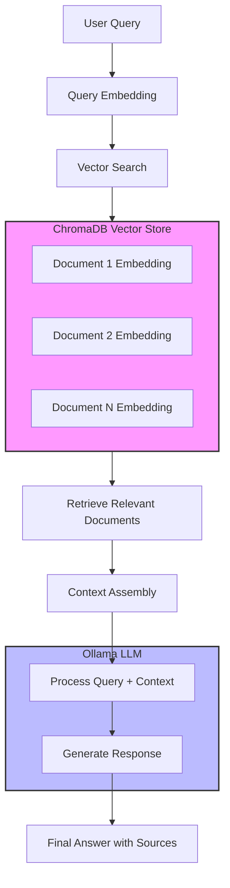

# RAG Langchain
This project implements a RAG (Retrieval Augmented Generation) system using LangChain with the following main components:

**1. Database Creation**
**2. Embedding**
**3. Query Data**

## Basic Idea


## Project Structure
- `chroma/` - Vector database storage
- `data/book/` - Source documents directory
- `create_database.py` - Database creation script
- `compare_embedding.py` - Basic embedding comparison example
- `query_data.py` - Combining both scriptes with the query LLM

## Requirements
- Python
- LangChain
- Ollama
    - **Local Model:** deepseek-r1:1.5b
        ```bash
        ollama pull deepseek-r1:1.5b
        ```
- Embedding
    - **Local Embedding Model:** nomic-embed-text
        ```bash
        ollama pull nomic-embed-text
        ```
- ChromaDB

## Run the code
1. Clone the git repo and change directory to the project-name using the commands below:
    ```bash
    git clone https://github.com/usman619/RAG_Langchain.git
    cd RAG_Langchain
    code .
    ```
2. Install all the required packages using the command below:
    ```bash
    pip install -r requirements.txt
    ```
2. Create the ChromaDB by running the python script below:
    ```bash
    python create_database.py
    ```
3. Run the main file `query_data.py` to run this repo:
    ```bash
    python query_data.py <query>
    ```

## Database Creation (create_database.py)
- Loads markdown documents from the book directory
- Splits text into smaller chunks (300 characters with 100 character overlap) 
- Creates embeddings using Ollama's nomic-embed-text model
- Stores the embeddings in a Chroma vector database

## Embedding Comparison Example (compare_embedding.py)
- Generates embeddings for word pairs using Ollama
- Calculates cosine similarity and distance between the embeddings
- Currently compares "apple" and "iphone" as an example
- Can optionally use OpenAI embeddings (commented out)

## Query Data (query_data.py)
- Combines the database and embedding functionality for text querying
- Takes user questions as input via command line arguments
- Retrieves relevant context from the Chroma vector database
- Uses Ollama LLM to generate answers based on the retrieved context
- Returns answers with source citations from the original text
- Example usage demonstrates querying Alice in Wonderland text

### Example Output
```bash
❯python query_data.py "How does Alice meet the Mad Hatter?"

Human: 
    Answer the following question based on only the given conext:
    
    “In that direction,” the Cat said, waving its right paw round, “lives a Hatter: and in that direction,” waving the other paw, “lives a March Hare. Visit either you like: they’re both mad.”

“But I don’t want to go among mad people,” Alice remarked.
---
“Have you guessed the riddle yet?” the Hatter said, turning to Alice again.

“No, I give it up,” Alice replied: “what’s the answer?”

“I haven’t the slightest idea,” said the Hatter.

“Nor I,” said the March Hare.
---
“Really, now you ask me,” said Alice, very much confused, “I don’t think—”

“Then you shouldn’t talk,” said the Hatter.

    -----

Answer the question based on the above context: How does Alice meet the Mad Hatter?
Response: <think>...</think>
Answer: Alice meets the Mad Hatter by asking a riddle about meeting someone mad, and upon not knowing the answer, the March Hatter tells her not to talk anymore, implying that once you meet someone mad, you shouldn't share further info.
Sources: ['data/book/alice_in_wonderland.md', 'data/book/alice_in_wonderland.md', 'data/book/alice_in_wonderland.md']
```

### Youtube Video:
- Learned from: [pixegami](https://youtu.be/tcqEUSNCn8I?si=WdQZEYaqedAPpbNS)